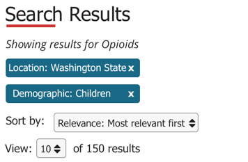

# Search Page Header

Group: Search Components
Pattern Type: component

## Overview of Component Group

Collectively these components are shown at the top of every search page.

large screen

small screen

## Components

| id | name | component | content notes | design notes | functional notes | printing rules |
| ------------- | ------------- | ------------- | ------------- | ------------- | ------------- | ------------- |
| 1 | Page Title | [Page Title specs](https://mylink) | Title text = "Search" , Page summary is null |  |  |  |
| 2 | Keyword | [Keyword Results Text](https://mylink) | Text = "Showing results for {Keyword}" | Text is in italics |  |  |
| 3 | Applied Filters | [Applied Filters](https://mylink) | Text is the applied filter. If filter is inside an parent, the parent is also show (e.g. Location: Washington) | uses the primary button with font-awesome close icon | OnClick/On Tap of button, filter is removed from result set. | These print as text (not as buttons)
"Applied filters: {Filter name}, {Filter name}" |
| 4 | Search Settings | [Sort & View Search Settings] |  |  |  | Do not print! |
